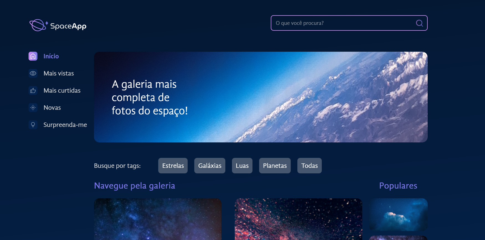

<h4 align="center"> 
	
</h4>
<p align="center">
 <a href="#-sobre-o-projeto">Sobre</a> •
 <a href="#-funcionalidades">Funcionalidades</a> •
 <a href="#-layout">Layout</a> •
 <a href="#-tecnologias">Tecnologias</a> •
 <a href="#-autor">Autor</a> • 
 <a href="#user-content--licença">Licença</a>
</p>

# STUDIES

<h1 align="center">
    
</h1>
    

## 💻 Sobre o projeto

🚀 SpaceApp é um catálogo de imagens do espaço, onde conseguiremos transformar fotos em favoritas. 

---

## ⚙️ Funcionalidades

- [x] Catálogo de imagens do espaço;
- [x] Permite que o usuário pesquise as imagens de acordo com as Tags ou Buscas;
- [x] Permite que o usuário favorite as imagens que quiser;


## 🎨 Layout

O layout da aplicação está disponível no Figma: https://www.figma.com/file/2LFVvhAwy08j6kCaPcnOzs/SpaceApp-%7C-React%3A-arquivos-est%C3%A1ticos-com-integra%C3%A7%C3%A3o-de-conceito-%C3%A1rea-de-component?type=design&node-id=89-4&mode=design.


## 📝 Aprendizados

Neste projeto fiz um projeto com Vite e, em seguida, incorporei a biblioteca de estilo Styled Components. Continuei desenvolvendo uma galeria de componentes atraentes, projetei uma modal de estilos que permite expandir imagens e adicionar favoritos.

Por último, importei várias fontes personalizadas que deram um visual consistente ao projeto.

Foi criado aplicações React com uma estrutura sólida, utilizando conceitos como Flexbox, além de um projeto com estilos avançados através do Styled Components.

Explorei a manipulação de arquivos estáticos, trabalhando com imagens e arquivos JSON. Combinei o uso de um arquivo estático para visualizar fotos e seus caminhos, integrando com o estado do React.


#### 🧭 Rodando a aplicação web (Modo desenvolvimento)

```bash
# Clone este repositório
$ git clone https://github.com/alura-cursos/space-app
# Acesse a pasta do projeto no seu terminal/cmd
$ cd  spaceapp
# Instale o vitejs
$ npm create vite@latest
# Instale as dependências
$ npm install
# Execute a aplicação
$ npm run dev
# A aplicação será aberta na porta:5173 - acesse http://localhost:5173/
```
---

## 🛠 Tecnologias

As seguintes ferramentas foram usadas na construção do projeto:

#### **Website**

- **[React](https://reactjs.org/)**
- **[vitejs](https://vitejs.dev/guide/)**
- **[Sass](https://sass-lang.com/)**

#### **Utilitários**
- Editor: **[Visual Studio Code](https://code.visualstudio.com/)**
  - Extensão: **[S7 React/Redux/React-Native/JS snippets](https://marketplace.visualstudio.com/items?itemName=dsznajder.es7-react-js-snippets)**
- CSS Modules: **[CSS Modules](https://github.com/css-modules/css-modules)**
- Documentação do React: **[React Documentation](https://create-react-app.dev/docs/adding-a-stylesheet/)**

---

## 🦸 Autor

 <sub><b>Rafael Corrêa</b></sub></a> <a href="https://www.linkedin.com/in/correarafaelsantos/" title="SpaceApp">🚀</a>
 <br />
👋🏽 [Entre em contato pelo Linkedin!](https://www.linkedin.com/in/correarafaelsantos/)

---
